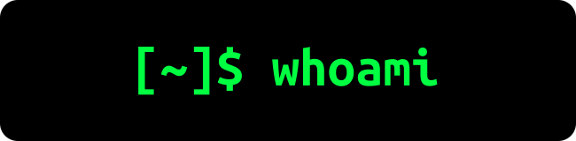

  

# 

  

### Cybersecurity | C/C++ | Algorithms | Systems

## 🚀 About Me

Cybersecurity enthusiast with a strong foundation in **C, C++ and Data Structures & Algorithms**, along with growing hands-on experience in **ethical hacking and penetration testing**. Certified **CWSE** and **CAPT**, and actively building practical projects like **Aegis-WAF** and **Sentinel** to strengthen real-world security and development skills. Continuously learning and improving in **secure coding, system design, and problem solving**.

## 💼 Current Work

- 🔭 I'm currently working on [**Aegis Web App Firewall**](https://github.com/maharshijd/Aegis-WAF)

## 🚀 Projects

| Project | Description | Links |
|---|---|---|
| Aegis Web App Firewall | Aegis-WAF – A modular Web Application Firewall built with Python and Docker that detects and blocks common web attacks such as SQL Injection, XSS, and malicious payloads using rule-based filtering and real-time request analysis, designed for secure, scalable deployment in modern web environments. | [GitHub](https://github.com/maharshijd/Aegis-WAF) |
| Optical Character Recognition | Developed an OCR system in Python to extract text from images using image processing and machine learning techniques, showcasing practical application of computer vision concepts. | [GitHub](https://github.com/maharshijd/Optical-Character-Recognition) |
| Snake game console based | A console-based implementation of the classic Snake Game, built from scratch in C using the Windows Console API. Features include real-time movement, scoring, and dynamic difficulty. Perfect for learning low-level programming, game logic, and real-time input handling. | [GitHub](https://github.com/maharshijd/classic-snake-c) |

### Aegis Web App Firewall

**Technologies Used:** Python, Docker

### Optical Character Recognition

**Technologies Used:** Python, OpenCV, Pillow, Tesseract

### Snake game console based

**Technologies Used:** C Programming Language

## 🎓 Education

| Institution | Degree | Duration |
|---|---|---|
| Symbiosis Institute of Technology | B.Tech | 2024-08 -  |

### B.Tech in Computer Science and Engineering
*Symbiosis Institute of Technology*

## 🌐 Connect with Me

&nbsp;&nbsp;&nbsp;&nbsp;&nbsp;&nbsp;&nbsp;&nbsp;&nbsp;&nbsp;&nbsp;&nbsp;

## 🛠️ Skills & Technologies

### 💻 Programming Languages

&nbsp;&nbsp;&nbsp;&nbsp;&nbsp;&nbsp;&nbsp;&nbsp;&nbsp;

### 💻 Frontend Development

### 💻 Mobile App Development

&nbsp;&nbsp;&nbsp;

### 💻 Database

&nbsp;&nbsp;&nbsp;&nbsp;&nbsp;&nbsp;

### 💻 DevOps

### 💻 Software

### 💻 Other

&nbsp;&nbsp;&nbsp;&nbsp;&nbsp;&nbsp;

## 📊 Stats & Activity

  

  

---

### "The quieter you become, the more you are able to hear." – Kali Linux

